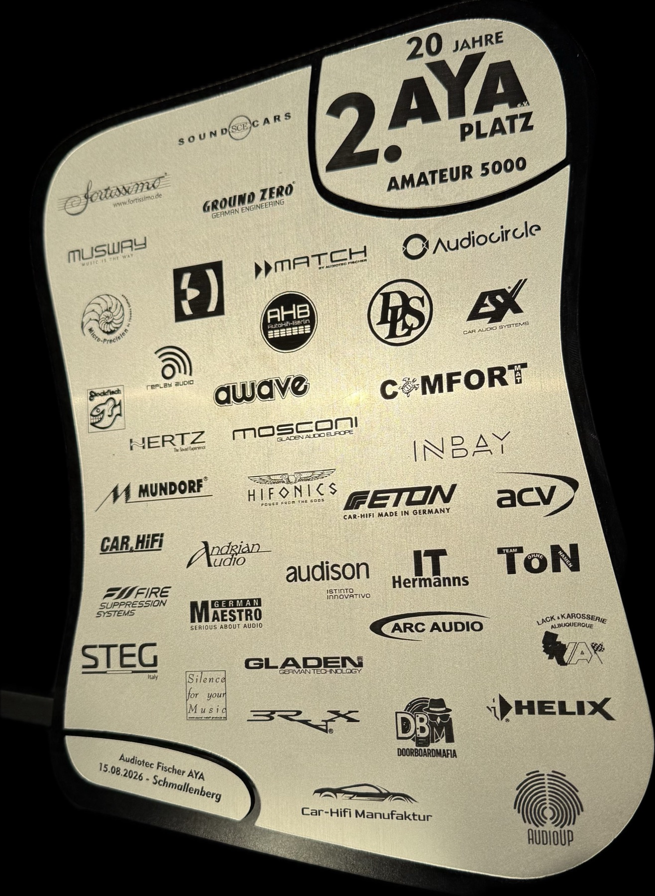

# KI-Assistent für Car-HiFi (Autosound Tuning Skill)

🇬🇧 [English](README.md) · 🇩🇪 **Deutsch** · 🇵🇱 [Polski](README.pl.md) · 🇺🇦 [Українська](README.uk.md) · ❓ [FAQ](FAQ.de.md) ·  [Roadmap (EN)](ROADMAP.md)

**In einfachen Worten:** Dies ist dein persönlicher KI-Meister für das Einstellen von Car-HiFi. Du willst eine perfekte Bühne und eine saubere tonale Balance, aber Graphen, Phasen und Laufzeiten erscheinen dir zu kompliziert? Dieser Assistent übernimmt den schwierigsten Teil. Er liest deine Mikrofonmessungen und führt dich Schritt für Schritt zum perfekten Sound.

- **Du misst — die KI rechnet:** Sie arbeitet mit der REW-Software zusammen, analysiert die Akustik deines Innenraums und schlägt genaue Einstellungen für EQ, Frequenzweichen und Laufzeitkorrektur vor.
- **Minimale Zeit im Auto:** Die Hauptberechnungen finden an deinem Schreibtisch zu Hause statt. Du machst nur die initialen Messungen im Auto und kommst dann mit fertigen Zahlen zurück, um dir das Ergebnis anzuhören und tiefer ins Tuning einzusteigen.
- **Schreibt nichts in deinen DSP — das machst du:** Der Assistent greift niemals direkt in deinen Prozessor ein. Er zeigt dir nur Zahlen und Graphen; du triffst die Entscheidung und gibst sie manuell ein.
- **Kein normaler Chat:** Der Projektstatus und alle Einstellungen werden als Dateien auf deiner Festplatte gespeichert, sodass zwischen den Sitzungen nichts "vergessen" wird und du jederzeit einen Schritt zurückgehen kannst.
- **Zwei KIs (optional):** Das System kann zwei KIs (Claude und Gemini) verwenden. Eine schlägt Einstellungen vor, die andere kritisiert und überprüft sie. Aber der letzte Richter ist dein Ohr: Du hörst zu und entscheidest, anstatt ihre Ideen einfach blind zu übernehmen.
- **Arbeitet mit Fakten:** Eine Überprüfung, der Daten fehlen, verweigert die Arbeit. Die KI rät keine Einstellungen — wenn die Messungen falsch gemacht wurden oder unzureichend sind, wird eine spezifische Prüfung die Berechnung einfach ablehnen und stoppen.

## Auf Wettbewerben bewährt

Mit der Version 2.x dieser Methode holte das Auto des Autors im Jahr 2026 vier Auszeichnungen bei **EMMA**- und **AYA**-Meisterschaften (die erste Auszeichnung wurde errungen, bevor die Methode zu einem Skill wurde, durch KI-Tipps anhand derselben Graphen, was die Idee für diesen Skill lieferte). Die neueste Version 3.x (mit grafischer Oberfläche) befindet sich derzeit in der Beta-Phase und hat sich bei Wettbewerben noch nicht bewiesen. Für ein garantiertes Ergebnis entscheiden sich daher viele für die bewährte Version 2.8.x.

<p align="left">
  
  &nbsp;&nbsp;&nbsp;
  
  &nbsp;&nbsp;&nbsp;
  
  &nbsp;&nbsp;&nbsp;&nbsp;&nbsp;&nbsp;&nbsp;
  
</p>

*Deine Anlage kann auch wie ein Champion klingen!*

> [!CAUTION]
> Die KI ist ein Assistent, aber die Verantwortung liegt bei dir. Eine manuell mit Tippfehler eingegebene Zahl kann einen Hochtöner durchbrennen lassen. Überprüfe immer die Trennfrequenzen, bevor du den Ton einschaltest, und beginne immer mit geringer Lautstärke.

## Was du für den Start brauchst

Du musst kein Programmierer sein — das Programm lässt sich mit einem einzigen Befehl installieren. Aber an Hardware und Abos brauchst du Folgendes:

1. **Messmikrofon** (z.B. UMIK-1, besser ein XLR-Mikrofon mit Soundkarte und physischem Loopback).
2. **Prozessor (DSP)** in deinem Auto.
3. **REW (Room EQ Wizard) Software** — zwingend die **Beta-Version** (in der normalen Release-Version gibt es gar keinen API-Reiter). Hol dir die Beta unter [roomeqwizard.com/beta.html](https://www.roomeqwizard.com/beta.html). Nach dem Start von REW gehe auf *Preferences → API*, aktiviere **Start the API when REW starts** und klicke auf **Start server**.
4. **Kostenpflichtiges Claude-Abo (Pro oder Max)** — diese KI erledigt die Hauptarbeit und löst komplexe mathematische Probleme. Ohne Internet am Auto funktioniert die Sitzung nicht.

*(Wir empfehlen außerdem ein kostenloses GitHub-Konto, um deinen Tuning-Verlauf automatisch in einem privaten Bereich zu speichern).*

## Installation und Start (Version 3.x — Beta)

Wir haben einen Installer entwickelt, der alles Nötige herunterlädt und eine praktische **grafische Anwendung (Autosound TCC)** vorbereitet. Der Vorgang dauert 10–20 Minuten (unter macOS fragt das System einmalig nach deinem Passwort, unter Windows erscheint ein Git-Berechtigungsdialog).

**macOS** — öffne das Terminal (⌘-Space drücken, "terminal" tippen, Enter) und füge ein:
```sh
curl -fsSL https://raw.githubusercontent.com/ayukhno/autosound-tuning-skill/main/install.sh | bash
```

**Windows** — öffne PowerShell (Start drücken, "powershell" tippen, Enter) und füge ein:
```powershell
irm https://raw.githubusercontent.com/ayukhno/autosound-tuning-skill/main/install.ps1 | iex
```

**Nach der Installation:**
1. Auf dem Desktop erscheint die App **Autosound TCC**. Öffne sie.
2. Erstelle einen neuen leeren Ordner für dein Auto (z.B. `MyCarTuning`) und wähle ihn im Programm aus.
3. **WICHTIG:** Stelle vor deiner ersten Nachricht sicher, dass das Anstrengungsniveau (Effort) für **Claude Opus** mindestens auf `xhigh` steht (dies ist der Standardwert). Für sehr komplexe Schritte verwende `max`. Das ist entscheidend: Eine schwächere Modellstufe hält bei einem Fehler nicht an; sie stimmt dir einfach zu, was zu "stillen Fehlern" beim Tuning führt. *Hinweis: Änderungen am Effort-Level gelten erst für die nächste Sitzung.*
4. Schreibe in den App-Chat: **"tune a new car from scratch"**. Die KI fängt an, Fragen zu stellen und nimmt dich an die Hand.

▶ **[Öffne den Target Curve Visualizer online](https://ayukhno.github.io/autosound-tuning-skill/_curve-visualizer.html?lang=de)** — ziehe deine Kurve oder eine Standardkurve aus dem [Nono Tuning Tool](https://nonotuningtool.com) hinein, vergleiche Graphen und speichere sie.

---

**Wettbewerbserprobte Version 2.8.x** — [Weg 3 im FAQ](FAQ.de.md#vier-optionen-zur-nutzung)

Wenn du genau die **2.8.x** Version nutzen möchtest, mit der die Wettbewerbe gewonnen wurden: Diese funktioniert ausschließlich über das Terminal. Anstelle der obigen Skripte führe in einem Terminal mit bereits installiertem `claude` (Claude Code) zwei Befehle aus:
```sh
claude plugin marketplace add ayukhno/autosound-tuning-skill
claude plugin install autosound-tuning
```
*(Falls `claude` noch nicht installiert ist, kannst du es mit dem offiziellen Skript hinzufügen: `curl -fsSL https://claude.ai/install.sh | sh`, oder alternativ über npm).*

## Wie der Tuning-Prozess abläuft

1. **Vorbereitung zu Hause:** Du erzählst der KI von deinem System (welche Lautsprecher, welcher Prozessor).
2. **Messungen im Auto (einmalig):** Du setzt dich mit dem Mikrofon ins Auto, aktivierst die grundlegenden Schutzfilter am DSP und nimmst einfach eine Reihe von Sweeps für jeden Treiber auf. *Hinweis: Ein Tiefmitteltöner ohne Tiefpassfilter (LPF) klingt obenrum beim Sweep schrill — das ist normal (Membranaufbruch), brich die Messungen nicht ab.*
3. **Mathematik am Schreibtisch:** Du sitzt am Computer (ohne das Auto in der Nähe). Die KI analysiert die Messungen, koppelt den Subwoofer an den Tiefmitteltöner, richtet die Bühne aus und berechnet den Equalizer. Der Schreibtisch prognostiziert nur die Ergebnisse; das Auto verifiziert sie anschließend. Wenn die Prognosen des Schreibtischs bei der Überprüfung nicht mit der Realität übereinstimmen, macht das System die Schritte rückgängig.
4. **Genuss im Auto:** Du gehst zurück zum Auto, gibst die fertigen Zahlen in den DSP ein, spielst Test- und Lieblingslieder ab und genießt. Wenn etwas leicht brummt, "in den Ohren wehtut" oder "die Bühne verschoben ist" — sagst du es der KI, und ihr korrigiert das Problem gezielt.

## Feedback, Support und Datenschutz

**Datenschutz:** Der Skill lernt aus jedem Tuning und sendet, nur mit deiner ausdrücklichen Zustimmung, verallgemeinerte Lektionen an eine gemeinsame Wissensdatenbank. Er sammelt niemals persönliche Daten und versendet keine vollständigen Messungen.

**Probleme und Bugs:**
- Wenn mit der Tuning-Logik selbst etwas nicht stimmt: [Öffne ein Issue auf GitHub (autosound-tuning-skill)](https://github.com/ayukhno/autosound-tuning-skill/issues/new/choose).
- Wenn das Problem die grafische Oberfläche (Autosound TCC) betrifft — schreibe ins [Repository der TCC-App](https://github.com/ayukhno/autosound-tcc/issues/new/choose).

Dieses Tool ist **komplett kostenlos**. Der Code und die Skripte stehen unter der **MIT**-Lizenz, die Dokumentation und die Methode selbst unter **CC BY-SA 4.0**. 

Wenn es dir Wochen an Tuning-Zeit gespart hat und du dem Autor danken möchtest, kannst du das hier tun:
💜 **[GitHub Sponsors](https://github.com/sponsors/ayukhno)** · ☕ **[Monobank Jar (UA)](https://send.monobank.ua/jar/8wThVcodjm)**

**Guten Sound!**
