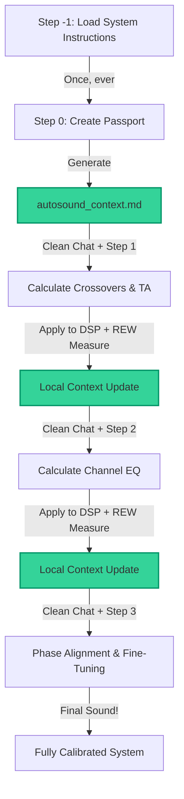

# Manual Step-by-Step DSP Tuning in Any Web Chat

> [!CAUTION]
> ### 🛑 EXPERIMENTAL & UNSUPPORTED CONCEPT
> This manual web-chat tuning pipeline is purely an **experimental concept** and is **not officially supported**. 
> Web chats (such as ChatGPT, Claude web, Gemini Advanced, and AI Studio) are highly unstable, prone to hallucinating values, and suffer from severe "memory drift" over long conversations. Use these templates at your own risk. 
> 
> **For a stable, reliable, automated, and mathematically validated tuning experience, we highly recommend using the official terminal-based agent setup via Claude Code instead.**

Welcome to the manual car audio tuning pipeline!

If you are not using the automatic terminal agent (Claude Code), you can still attempt to achieve similar high-precision phase and time alignment in any standard web chat interface (**ChatGPT Plus**, **Claude Pro**, **Gemini Advanced / AI Studio**).

This `manual_step-by-step` folder contains a set of deterministic, stateless prompt and data templates that help guide a generic web chat to analyze your car acoustics.

---

## 📐 The Stateless Web Chat Philosophy

Generic web chats have a limited memory window. When a conversation gets too long, models begin to suffer from "memory drift"—they start modifying previously agreed-upon delays, altering crossover slopes, and hallucinating values.

To bypass this, we use a **Stateless Architecture**:

1. **Unified System Instructions:** Copy the entire contents of **[step_-1_general_system_instructions.md](step_-1_general_system_instructions.md)** ONCE and paste it into the **System Instructions** field in Google AI Studio, the **Custom Instructions** field in ChatGPT, or the equivalent system prompt area of another AI chat client. It contains the full system role, formulas, safety limits, and workflow for all steps (0 to 3) — once added, you can open a new chat tab for any step and simply say *"I am on Step 1"*, *"I am on Step 2"*, etc., without re-configuring anything.
   > ⚠️ **ChatGPT's Custom Instructions field has a small character limit** (well under this file's size) — it will likely reject the full paste. If it does, skip Custom Instructions and instead paste the entire file as the **very first message** of a brand-new chat; the model still picks up the same system role and protocol from there, it's just a regular message instead of a dedicated field.
2. **Stateless Sessions:** Every tuning step is executed in a **brand-new, clean chat session**. This completely prevents "memory drift" and error accumulation.
3. **Simple User Prompts:** For each step, you simply open a new tab (which inherits the system prompt) and paste the short user prompt for that step, attaching your `autosound_context.md` passport file and REW measurements.

---

## ⚠️ Speaker Safety Before Your First Measurement

Tweeters and midranges are physically fragile. **Never** run a REW sweep on them without an active protective high-pass filter (HPF) in your DSP, and always start at a low test volume.

* **Tweeters:** HPF no lower than ~1000–2000 Hz (≈1.1× the driver's Fs), 24 dB/oct slope (e.g. LR4).
* **Midranges:** HPF no lower than ~100–300 Hz (≈1.1× the driver's Fs), 24 dB/oct slope.

Once you have your `autosound_context.md`, `step_-1_general_system_instructions.md`'s Step 0 protocol computes the exact safe HPF from your own drivers' Fs.

---

## 📂 Folder Structure

You will find the following files in this folder:

1. **[step_-1_general_system_instructions.md](step_-1_general_system_instructions.md)** — **The Core System Instructions**. Copy and paste this into the "System Instructions" box of your chat workspace once at the beginning.
2. **[autosound_context.md](autosound_context.md)** — **Your live working passport**, shipped here as a genuinely **empty** file (0 bytes) on purpose — there's nothing in it to accidentally paste "into" or merge with. Step 0's AI output becomes its contents (or hand-fill it yourself, starting from the template); every later step updates one section of this same file.
3. **[autosound_context_template.md](autosound_context_template.md)** — The pristine, never-edited reference copy of the passport structure — used as Step 0's input, or to restore `autosound_context.md` if you ever need a clean reset.
4. **[step_0_intake_and_setup.md](step_0_intake_and_setup.md)** — Prompt template to let the AI conduct an interactive interview and generate your `autosound_context.md` contents for you.
5. **[step_1_baseline_analysis.md](step_1_baseline_analysis.md)** — Prompt to analyze raw sweeps and calculate baseline crossovers, delays, and initial gain asymmetry.
6. **[step_2_tonal_balance_eq.md](step_2_tonal_balance_eq.md)** — Prompt to calculate per-channel EQ matching your target curve and calculate exact micro-delays or Helix Phase angles.
7. **[step_3_fine_tuning_and_phase.md](step_3_fine_tuning_and_phase.md)** — Prompt for subjective fine-tuning based on your listening feedback using professional test tracks.
8. **[measurement_and_naming_guide.md](measurement_and_naming_guide.md)** — Guide on how to properly take measurements in REW (MMM RTA, impulse sweeps, naming conventions).

---

## 🛠️ Step-by-Step Calibration Protocol

### ➖ Step -1: Load System Instructions (Once)
* **Template:** [step_-1_general_system_instructions.md](step_-1_general_system_instructions.md).
* **Action:** Copy its entire contents into the **System Instructions** field (AI Studio) or **Custom Instructions** (ChatGPT) — or, if that field is too small, paste the whole file as the first message of a brand-new chat instead.
* **Result:** Done once per project. Every chat tab you open from now on (Steps 0–3) inherits this same system role and protocol — you never paste it again.

---

### 🏁 Step 0: System Intake & Passport Creation
* **Template:** [step_0_intake_and_setup.md](step_0_intake_and_setup.md).
* **Action:** Copy the Step 0 prompt into a clean chat, pasting in `autosound_context_template.md`'s contents where indicated. The AI will interview you (2-3 questions at a time) and generate a fully populated Markdown block.
* **Manual quick start (skip the interview):** Already know your gear? Copy `autosound_context_template.md`'s contents into the empty **[autosound_context.md](autosound_context.md)** and replace the `[Placeholder]` fields yourself — no AI chat needed for this step.
* **Result:** Paste the AI's generated block (Path 1) or your hand-filled version (Path 2) straight into the empty **[autosound_context.md](autosound_context.md)**. This one file carries your system state through every later step — when a later step's AI returns an updated block, replace that step's section only; never leave two copies of the same section in the file.

---

### ⏱️ Step 1: Baseline Crossovers & Delays
* **Template:** [step_1_baseline_analysis.md](step_1_baseline_analysis.md).
* **Measurement Requirements:**
  * Single impulse sweeps (`sw`) for each of your speakers with timing reference enabled (Acoustic Timing Reference or XLR loopback).
  * MMM RTA measurements (`rta`) for each speaker taken around your head position.
  * All crossovers and EQ in your DSP must be bypassed (or temporary safe HPF enabled for tweeters and midranges).
* **Chat Run:** Open a **NEW** clean chat. Send the Step 1 prompt along with your `autosound_context.md` and upload your REW `.txt` or `.csv` export files (24 PPO, 1/6 oct).
* **DSP Entry:** Apply the calculated crossover points, slopes, and delays (in samples) into your DSP.
* **Context Update:** Copy the AI's formatted output block and replace the Step 1 section in your local `autosound_context.md`. Close the chat.

---

### 🎛️ Step 2: Tonal Balance, Channel EQ & Phase Alignment
* **Template:** [step_2_tonal_balance_eq.md](step_2_tonal_balance_eq.md).
* **Measurement Requirements:**
  * Crossovers, delays, and gains from Step 1 (`v1`) must be active in your DSP!
  * MMM RTA measurements (`rta`) for each speaker to calculate PEQ filters.
  * Single sweeps (`sw`) and summation sweeps (`L w+m_2`, `R w+m_2`, `L m+tw_2`, `R m+tw_2`, `SW+Ws_2`) to verify crossovers.
* **Chat Run:** Open a **NEW** clean chat. Send the Step 2 prompt, select your target curve, enter the measured phase values at the crossovers, upload your REW measurement exports, and paste your `autosound_context.md`.
* **Result:** The AI will calculate precise PEQ filters, micro-delays, and Helix Phase angles.
* **DSP Entry:** Apply the PEQ bands, fine delays, and phase angles to your DSP.
* **Context Update:** Copy the AI's formatted output block and replace the Step 2 section in your local `autosound_context.md`. Close the chat.

---

### 🔄 Step 3: Subjective Fine-Tuning & Listening Loops
* **Template:** [step_3_fine_tuning_and_phase.md](step_3_fine_tuning_and_phase.md).
* **Measurement Requirements:**
  * All Step 2 (`v2`) settings active in your DSP.
  * MMM RTA measurements of combined sides: `L_3` (full left), `R_3` (full right), `ALL_3` (full front stage with subwoofer).
  * Measurement sweeps of combined sides: `L_3 (sw)`, `R_3 (sw)`, `ALL_3 (sw)`.
* **Listening Check:** Sit in the driver's seat. Play high-quality test tracks. Evaluate: center image focus, stage size (width, height, depth), vocal harshness, sibilance, and bass boominess.
* **Chat Run:** Open a **NEW** clean chat. Send the Step 3 prompt along with your updated `autosound_context.md`, upload combined REW measurements, and describe your listening feedback in detail.
* **DSP Entry:** Apply the recommended micro-adjustments to EQ bands or channel levels.
* **Iteration:** Repeat this step as many times as necessary to reach your personal acoustic ideal!

---

## 💡 Pro Tip for Google AI Studio Users

If you are using the free developer interface in **Google AI Studio** with **Gemini 1.5 Pro**:
1. Copy the contents of **[step_-1_general_system_instructions.md](step_-1_general_system_instructions.md)** and paste it into the **System Instructions** field on the right-hand panel.
2. This field persists across all new tabs/chats in the same project, so you don't need to reconfigure it.
3. In the message box, simply paste the short prompt template of the step you are on, attach your `autosound_context.md` file, and upload your REW exports.
4. This ensures clean, focused, and mathematically precise responses from the model.
