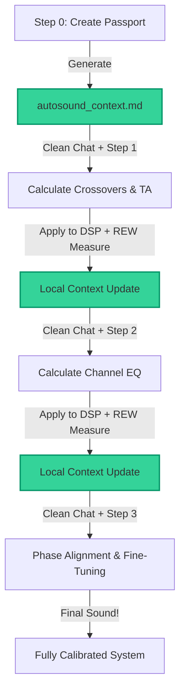

# Manual Step-by-Step DSP Tuning in Any Web Chat

> [!CAUTION]
> ### 🛑 EXPERIMENTAL & UNSUPPORTED CONCEPT
> This manual web-chat tuning pipeline is purely an **experimental concept** and is **not officially supported**. 
> Web chats (such as ChatGPT, Claude web, Gemini Advanced, and AI Studio) are highly unstable, prone to hallucinating values, and suffer from severe "memory drift" over long conversations. Use these templates at your own risk. 
> 
> **For a stable, reliable, automated, and mathematically validated tuning experience, we highly recommend using the official terminal-based agent setup via Claude Code instead.**

Welcome to the manual car audio tuning pipeline!

If you are not using the automatic terminal agent (Claude Code), you can still attempt to achieve similar high-precision phase and time alignment in any standard web chat interface (**ChatGPT Plus**, **Claude Pro**, **Gemini Advanced / AI Studio**).

This `manual_step-by-step` folder contains a set of deterministic, stateless prompt and data templates that help guide a generic web chat to analyze your car acoustics.

---

## 📐 The Stateless Web Chat Philosophy

Generic web chats have a limited memory window. When a conversation gets too long, models begin to suffer from "memory drift"—they start modifying previously agreed-upon delays, altering crossover slopes, and hallucinating values.

To bypass this, we use a **Stateless Architecture**:

1. **Unified System Instructions:** You copy the contents of **[general_system_instructions.md](general_system_instructions.md)** once and paste it into the **System Instructions** field (in Google AI Studio) or **Custom Instructions** (in ChatGPT). This contains the full system role, formulas, safety limits, and workflow for all steps (0 to 3).
2. **Stateless Sessions:** Every tuning step is executed in a **brand-new, clean chat session**. This completely prevents "memory drift" and error accumulation.
3. **Simple User Prompts:** For each step, you simply open a new tab (which inherits the system prompt) and paste the short user prompt for that step, attaching your `autosound_context.md` passport file and REW measurements.

---

## 📂 Folder Structure

You will find the following files in this folder:

1. **[general_system_instructions.md](general_system_instructions.md)** — **The Core System Instructions**. Copy and paste this into the "System Instructions" box of your chat workspace once at the beginning.
2. **[autosound_context_template.md](autosound_context_template.md)** — Template for a quick manual start (if you want to fill in your speaker models and hardware configuration yourself without an AI interview).
3. **[step_0_intake_and_setup.md](step_0_intake_and_setup.md)** — Prompt template to let the AI conduct an interactive interview and generate your `autosound_context.md` file for you.
4. **[step_1_baseline_analysis.md](step_1_baseline_analysis.md)** — Prompt to analyze raw sweeps and calculate baseline crossovers, delays, and initial gain asymmetry.
5. **[step_2_tonal_balance_eq.md](step_2_tonal_balance_eq.md)** — Prompt to calculate per-channel EQ matching your target curve and calculate exact micro-delays or Helix Phase angles.
6. **[step_3_fine_tuning_and_phase.md](step_3_fine_tuning_and_phase.md)** — Prompt for subjective fine-tuning based on your listening feedback using professional test tracks.
7. **[measurement_and_naming_guide.md](measurement_and_naming_guide.md)** — Guide on how to properly take measurements in REW (MMM RTA, impulse sweeps, naming conventions).

---

## 🛠️ Step-by-Step Calibration Protocol

### 🏁 Step 0: System Intake & Passport Creation
* **Template:** [step_0_intake_and_setup.md](step_0_intake_and_setup.md).
* **Action:** Copy the Step 0 prompt into a clean chat. The AI will interview you (2-3 questions at a time) and generate your `autosound_context.md` file.
* **Result:** Create and save a local file named `autosound_context.md`.

---

### ⏱️ Step 1: Baseline Crossovers & Delays
* **Template:** [step_1_baseline_analysis.md](step_1_baseline_analysis.md).
* **Measurement Requirements:**
  * Single impulse sweeps (`sw`) for each of your speakers with timing reference enabled (Acoustic Timing Reference or XLR loopback).
  * MMM RTA measurements (`rta`) for each speaker taken around your head position.
  * All crossovers and EQ in your DSP must be bypassed (or temporary safe HPF enabled for tweeters and midranges).
* **Chat Run:** Open a **NEW** clean chat. Send the Step 1 prompt along with your `autosound_context.md` and upload your REW `.txt` or `.csv` export files (24 PPO, 1/6 oct).
* **DSP Entry:** Apply the calculated crossover points, slopes, and delays (in samples) into your DSP.
* **Context Update:** Copy the AI's formatted output block and replace the Step 1 section in your local `autosound_context.md`. Close the chat.

---

### 🎛️ Step 2: Tonal Balance, Channel EQ & Phase Alignment
* **Template:** [step_2_tonal_balance_eq.md](step_2_tonal_balance_eq.md).
* **Measurement Requirements:**
  * Crossovers, delays, and gains from Step 1 (`v1`) must be active in your DSP!
  * MMM RTA measurements (`rta`) for each speaker to calculate PEQ filters.
  * Single sweeps (`sw`) and summation sweeps (`L w+m_2`, `R w+m_2`, `L m+tw_2`, `R m+tw_2`, `SW+Ws_2`) to verify crossovers.
* **Chat Run:** Open a **NEW** clean chat. Send the Step 2 prompt, select your target curve, enter the measured phase values at the crossovers, upload your REW measurement exports, and paste your `autosound_context.md`.
* **Result:** The AI will calculate precise PEQ filters, micro-delays, and Helix Phase angles.
* **DSP Entry:** Apply the PEQ bands, fine delays, and phase angles to your DSP.
* **Context Update:** Copy the AI's formatted output block and replace the Step 2 section in your local `autosound_context.md`. Close the chat.

---

### 🔄 Step 3: Subjective Fine-Tuning & Listening Loops
* **Template:** [step_3_fine_tuning_and_phase.md](step_3_fine_tuning_and_phase.md).
* **Measurement Requirements:**
  * All Step 2 (`v2`) settings active in your DSP.
  * MMM RTA measurements of combined sides: `L_3` (full left), `R_3` (full right), `ALL_3` (full front stage with subwoofer).
  * Measurement sweeps of combined sides: `L_3 (sw)`, `R_3 (sw)`, `ALL_3 (sw)`.
* **Listening Check:** Sit in the driver's seat. Play high-quality test tracks. Evaluate: center image focus, stage size (width, height, depth), vocal harshness, sibilance, and bass boominess.
* **Chat Run:** Open a **NEW** clean chat. Send the Step 3 prompt along with your updated `autosound_context.md`, upload combined REW measurements, and describe your listening feedback in detail.
* **DSP Entry:** Apply the recommended micro-adjustments to EQ bands or channel levels.
* **Iteration:** Repeat this step as many times as necessary to reach your personal acoustic ideal!

---

## 💡 Pro Tip for Google AI Studio Users

If you are using the free developer interface in **Google AI Studio** with **Gemini 1.5 Pro**:
1. Copy the contents of **[general_system_instructions.md](general_system_instructions.md)** and paste it into the **System Instructions** field on the right-hand panel.
2. This field persists across all new tabs/chats in the same project, so you don't need to reconfigure it.
3. In the message box, simply paste the short prompt template of the step you are on, attach your `autosound_context.md` file, and upload your REW exports.
4. This ensures clean, focused, and mathematically precise responses from the model.
