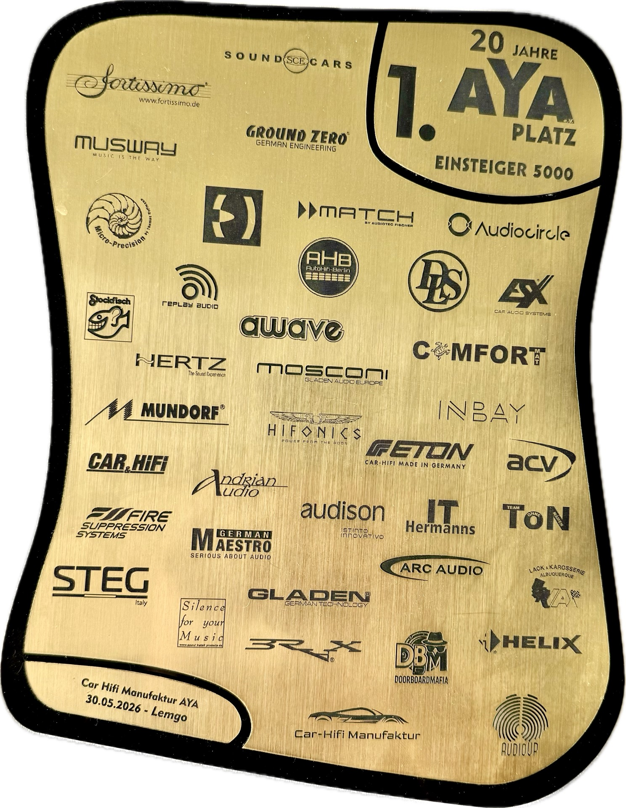
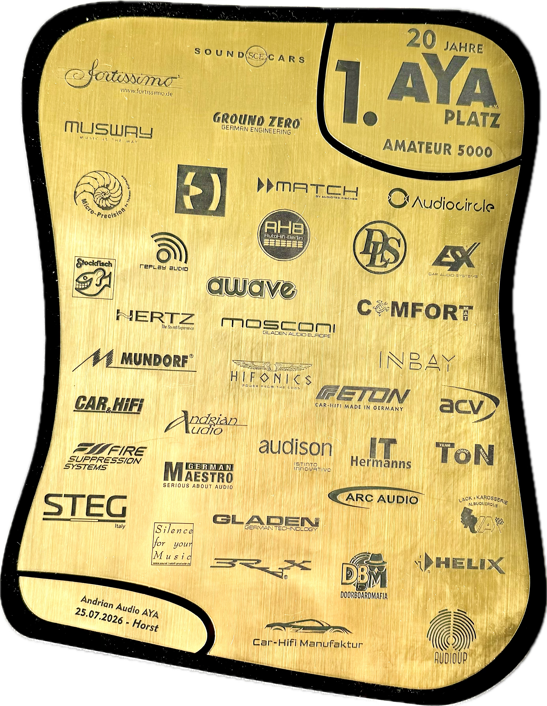
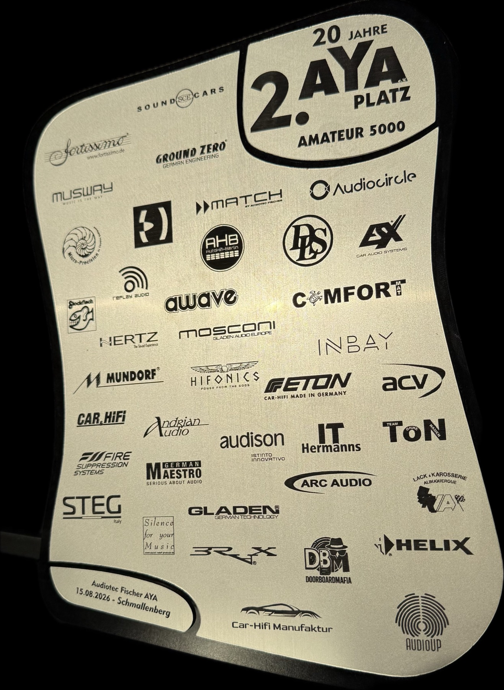
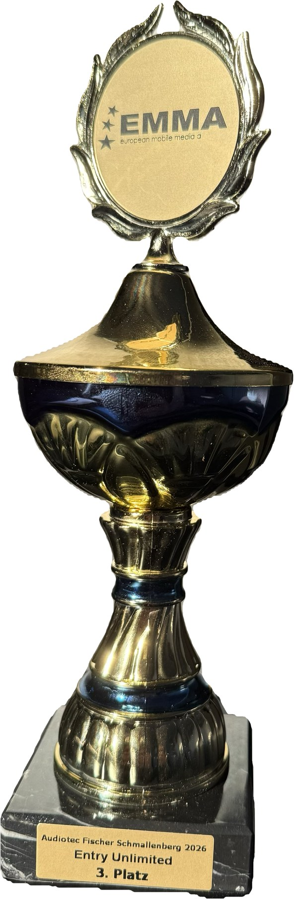
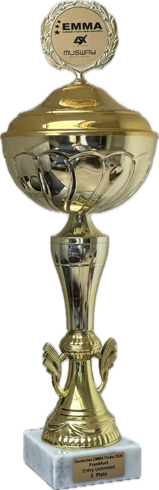

# AI Autosound Tuning Assistant (Autosound Tuning Skill)

🇬🇧 **English** · 🇩🇪 [Deutsch](README.de.md) · 🇵🇱 [Polski](README.pl.md) · 🇺🇦 [Українська](README.uk.md) · ❓ [FAQ](FAQ.md) · 📘 [TCC guide (EN)](https://github.com/ayukhno/autosound-tcc/blob/main/docs/guide/QUICK-GUIDE.md) ·  [Roadmap (EN)](ROADMAP.md)

**In simple terms:** This is your personal AI car audio tuning master. You want a perfect soundstage and a smooth tonal balance, but graphs, phases, and delays seem too complicated? This assistant will take care of the hard parts. It reads your microphone measurements and guides you step-by-step to perfect sound.

- **You measure — AI calculates:** It works together with REW software, analyzes your cabin acoustics, and proposes exact settings for EQ, crossovers, and time alignment.
- **Minimum time in the car:** The main calculations are done at your desk at home. You only do the initial measurements in the car, and then return with ready-to-use numbers to listen to the result and dive into deep tuning step-by-step.
- **Writes nothing to your DSP — you load it:** The assistant never touches your processor directly. It shows you numbers and graphs and prepares the EQ for import: on a Helix the whole Full EQ bank goes in through DSP PC-Tool in one step, and for processors without a file import the free [REW-EQ-CopyPaste-Assistant](https://github.com/IvanBakhmutov/REW-EQ-CopyPaste-Assistant) pastes it. You decide what goes in.
- **Not a regular chat:** The project state and all settings are saved to files on your disk, so nothing is "forgotten" between sessions and you can always roll back a step.
- **Two AIs, and your ear decides:** one AI proposes settings, a second one checks them. The check is part of the method; only the automatic link between them is optional — without it, you paste the package into any AI chat by hand. The final judge is your ear: you listen and decide, not just approve.
- **Works with facts:** The AI doesn't guess settings. If the measurements are wrong or not enough, a check catches it and asks you to retake the measurement — or to go on knowingly, accepting the risk of error.

## Proven in Competitions

With version 2.x of this method, the author's car took four awards in 2026 at **EMMA** and **AYA** championships (the first award was won before it was bundled into a skill, using AI hints from the same graphs, which inspired this project). Version 3.1, with a graphical interface, is the current release. The fifth award — 3rd place at the **German EMMA Final 2026** — came with 3.x, by refining the existing tune rather than tuning from scratch. The 2.8.x line behind the first four is still available: the FAQ, [path 3](FAQ.md#four-paths-of-usage).

<p align="left">
  
  &nbsp;&nbsp;&nbsp;
  
  &nbsp;&nbsp;&nbsp;
  
  &nbsp;&nbsp;&nbsp;&nbsp;&nbsp;&nbsp;&nbsp;
  
  &nbsp;&nbsp;&nbsp;&nbsp;&nbsp;&nbsp;&nbsp;
  
</p>

*Your system can sound like a champion too!*

> [!CAUTION]
> AI is an assistant, but the responsibility is yours. A manually entered number with a typo can burn a tweeter. Always check crossover frequencies before unmuting the sound, and always start at a low volume.

## What You Need to Start

The app installs with a single command. For hardware and subscriptions, you'll need the following:

1. **Measurement microphone** (e.g., UMIK-1, or preferably an XLR microphone with a sound interface and physical loopback).
2. **Processor (DSP)** in your car.
3. **REW (Room EQ Wizard) software** — **beta version** is required (the current release build, V5.31.3 of July 2024, has no API at all — check Help → About before you start). Get the beta build from [roomeqwizard.com/beta.html](https://www.roomeqwizard.com/beta.html). After launching REW, go to *Preferences → API*, check **Start the API when REW starts**, and click **Start server**.
4. **Paid Claude subscription (Pro or Max)** — Claude does the heavy lifting; it is the supported path, and the app is built for it. Other AIs can drive the run through `omp` (installed only when you ask) — at your own risk.

*(Recommended: a free GitHub account, to back your tuning history up to a private repository.)*

## How to Install and Start

**By default the installer sets up:** Claude Code, the tuning method with the Python libraries its tools need, the **Autosound TCC** desktop app, and the Gemini reviewer (`agy`). It takes 10–20 minutes. Depending on your system, other installers may ask for permission along the way — that is normal (details in the FAQ).

**macOS** — open Terminal (⌘-Space, type "terminal", Enter) and paste:
```sh
curl -fsSL https://raw.githubusercontent.com/ayukhno/autosound-tuning-skill/v3.0.66/install.sh | bash
```

**Windows** — open PowerShell (Start, type "powershell", Enter) and paste:
```powershell
irm https://raw.githubusercontent.com/ayukhno/autosound-tuning-skill/v3.0.66/install.ps1 | iex
```
*(The version in the address pins the installer itself; it always installs the newest release.)*

**Options:**

| What it does | macOS | Windows |
|---|---|---|
| models other than Claude, through `omp` | `--with-omp` | `-WithOmp` |
| the project backup on GitHub (a private repository; the keys stay out of it) | `--github` | `-GitHub` |
| the method without the app (terminal only) | `--terminal` | `-Terminal` |
| show the plan and change nothing | `--dry-run` | `-DryRun` |

With options — for example `omp` and the GitHub backup — on macOS:
```sh
curl -fsSL https://raw.githubusercontent.com/ayukhno/autosound-tuning-skill/v3.0.66/install.sh | bash -s -- --with-omp --github
```
and on Windows, as two lines:
```powershell
$i = irm https://raw.githubusercontent.com/ayukhno/autosound-tuning-skill/v3.0.66/install.ps1
& ([scriptblock]::Create($i)) -WithOmp -GitHub
```

**Already in Claude Code?** The method also installs as a plugin:
```sh
claude plugin marketplace add ayukhno/autosound-tuning-skill
claude plugin install autosound-tuning
```
A plugin brings the method's files only: in the first session type **`/autosound-tuning:setup`** — it checks the plugin against its signed release and installs the rest. The TCC desktop app is not included this way; add it with `/autosound-tuning:setup app` (or `/autosound-tuning:install-tcc`).

**After installation:**
1. The installer's last step signs you in: Claude, then the Gemini reviewer (`agy`), and GitHub if you asked for it.
2. Open the **Autosound TCC** app from your desktop.
3. Create an empty folder for your car (e.g., `MyCarTuning`) and select it in the app, with **AI main: Claude Opus (SDK)** and **AI critic: Gemini Pro (High)** — or **Gemini Flash (High)** if Pro is not offered to you.
4. **Important:** keep Claude Opus's effort at `xhigh` or higher (the default; `max` for hard steps).
5. Type in the app chat: **"tune a new car from scratch"**. The AI will start asking questions and lead you by the hand.

▶ **Target curves:** the method comes with its own curve for competitions, **SQ-Comp-Ref**. The **[Target Curve Visualizer](https://ayukhno.github.io/autosound-tuning-skill/_curve-visualizer.html?lang=en)** analyses and compares curves side by side — SQ-Comp-Ref, your own from REW, or the standard ones from [Nono Tuning Tool](https://nonotuningtool.com) — and saves the one you choose. How to pick one: the [target-curve guide](skills/autosound-tuning/references/patterns/target-curves/target_curves_guide.md).

## What the Tuning Process Looks Like

1. **Preparation at home:** You tell the AI about your system (which speakers, which processor).
2. **Measurements in the car (once):** one session; the tune is then designed at the desk.
   - Turn on the basic protective filters on your DSP.
   - Record each driver on its own: an RTA with the microphone moving around your head by hand, then sweeps from a **tripod microphone that does not move until the end** (the tripod block takes ~25 minutes).
   - Optionally: nine short hand-held sweeps around the listening point for the main drivers, which tell a cabin feature from a spot one — up to about an hour in all.
   - The app walks you through it block by block (the sheet: `capture-session-sheet.md`).
   - A midbass without a low-pass filter sounds harsh on top during a sweep — that is normal (cone breakup), keep going.
3. **Math at the desk:** You sit at your computer (without the car nearby). The AI analyzes measurements, joins the subwoofer to the midbass, evens out the soundstage, and calculates the EQ. The desk only predicts the results; the car then verifies them. If the desk's predictions do not match reality during verification — the system rolls back the steps.
4. **Enjoyment in the car:** You go back to the car, enter the ready numbers into the DSP, play test and favorite tracks, and enjoy. If something hums a little, "hurts the ear", or "the stage is off" — you tell the AI, and you pinpoint and correct the issue.

## Feedback, Support, and Privacy

**Privacy:** The skill learns from every tune and, only with your explicit consent, sends generalized lessons to a shared knowledge base. It never collects personal data and never sends full measurements.

**Issues and bugs:**
- If something is wrong with the tuning logic itself: [Open an issue on GitHub (autosound-tuning-skill)](https://github.com/ayukhno/autosound-tuning-skill/issues/new/choose).
- If the issue is related to the GUI (Autosound TCC) — write to the [TCC app repository](https://github.com/ayukhno/autosound-tcc/issues/new/choose).

This tool is **completely free**. The code and scripts are licensed under **MIT**, and the documentation and method itself under **CC BY-SA 4.0**. 

**Credits:** part of the DSP maths follows the logic of [Resonalyze](https://github.com/DIMOSUS/Resonalyze) by DIMOSUS (MIT) — the junction sum-loss metric and the HELIX channel phase control are ports of it, so that a tuner moving between the two tools gets one answer per filter, not two. Details in [`LICENSES/NOTICE.md`](LICENSES/NOTICE.md).

If it saved you weeks of tuning time and you want to thank the author, you can do it here:
💜 **[GitHub Sponsors](https://github.com/sponsors/ayukhno)** · ☕ **[Monobank Jar (UA)](https://send.monobank.ua/jar/8wThVcodjm)**

**Good sound!**
