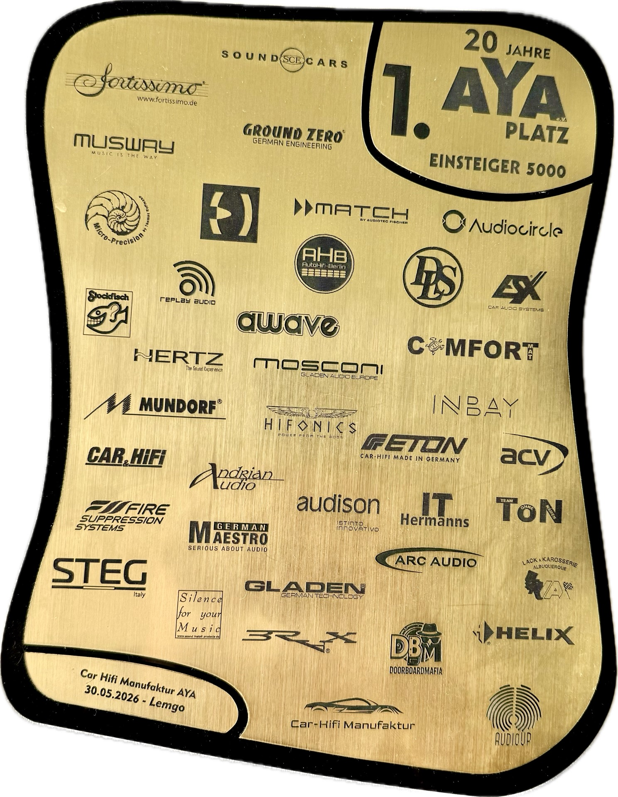
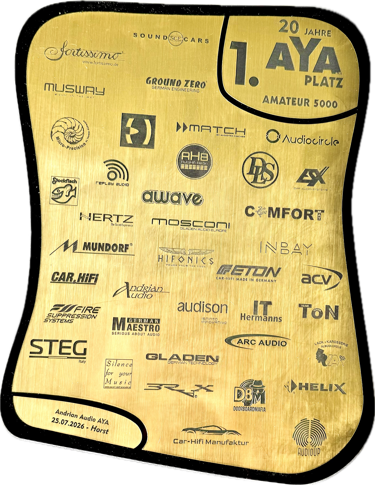

# Autosound Tuning Skill

🇬🇧 [English](README.md) · 🇩🇪 [Deutsch](README.de.md) · 🇵🇱 **Polski** · 🇺🇦 [Українська](README.uk.md) · ❓ [FAQ](FAQ.md) ·  [Roadmap (EN, szkic)](ROADMAP.md)

**W jednym zdaniu:** skill dla Claude, który prowadzi cię do czystego, przejrzystego, zrównoważonego brzmienia w *twoim* aucie. Wnosi całe rzemiosło do twojego konkretnego zestawu, czyta twoje pomiary z REW i pomaga wybrać każdą zmianę.

- **Współpracuje z REW**: pobiera pomiary przez API, zapisuje obliczone filtry EQ z powrotem w REW, skąd eksportujesz je do swojego DSP
- **Diagnozuje, zanim naprawi**: określa podatność na EQ, odbicia (problemy fazowe) i granice zniekształceń każdego głośnika na podstawie pomiaru bazowego, zanim zaproponuje jakąkolwiek zmianę zwrotnicy lub EQ
- **Zna rzemiosło**: krzywe docelowe, praktyki strojenia, proces krok po kroku
- **Ścieżki testowe**: czego słuchać i na której ścieżce (opisy, nie audio)
- **Uczy się twojego zestawu**: gromadzi wiedzę o aucie i sprzęcie, tylko za twoją zgodą

> [!CAUTION]
> AI może pomylić się w liczbach. Zawsze sprawdzaj częstotliwości zwrotnic, nachylenia filtrów i wartości EQ w swoim DSP, zanim wyłączysz wyciszenie, zwłaszcza przy głośnikach wysokotonowych, i zaczynaj od niskiej głośności.

> [!NOTE]
> **2.x to to, co dostajesz, i pozostaje wspierana.** Linia 3.x istnieje i jest otagowana — maszynowo czytelne pliki projektu, zapisany proces, aplikacja desktopowa — ale nie jest instalacją domyślną i nie stanie się nią, dopóki nie przeprowadzi się na niej pełnej sesji strojenia. Instalacja i aktualizacja dają 2.x; [wypróbowanie 3.x](#wypróbowanie-linii-3x) to świadoma decyzja.

> [!TIP]
> **Nagrody i Osiągnięcia**
> To podejście zostało stworzone nie tylko dla czystej przyjemności ze słuchania, ale także po to, by wygrywać. Udowodniło już swoją skuteczność w praktyce, przynosząc dwie nagrody:
> * **1 miejsce w klasie EINSTEIGER 5000 na zawodach AYA (30.05.2026, Lemgo)**. Wynik ten został osiągnięty dzięki analizie wykresów i poradom od Gemini.
> * **1 miejsce w klasie AMATEUR 5000 na zawodach AYA (25.07.2026, Horst)**. Zwycięstwo w kolejnej klasie, osiągnięte przy pomocy tego skilla i własnego słuchu.
> 
> <p align="left">
>   
>   &nbsp;&nbsp;&nbsp;
>   
> </p>
> 
> *Tutaj może być też twoja nagroda!*

## Spis treści

- [Dla kogo i dlaczego](#dla-kogo-i-dlaczego)
- [Jak wygląda prawdziwa praca i synergia różnych AI](#jak-wygląda-prawdziwa-praca-i-synergia-różnych-ai)
- [Pierwsze kroki](#pierwsze-kroki)
- [Polecane modele, tryby i moje doświadczenie](#polecane-modele-tryby-i-moje-doświadczenie)
- [Pełna konfiguracja i FAQ](#pełna-konfiguracja-i-faq)
- [Co tu jest](#co-tu-jest)
- [Dzielenie się doświadczeniem](#dzielenie-się-doświadczeniem)
- [Wsparcie](#wsparcie)
- [Licencja](#licencja)

## Dla kogo i dlaczego

* **Dla kogo:** Dla tych, którzy budują dźwięk w samochodzie i uczą się tego rzemiosła. To twój egzoszkielet: on niesie wiedzę i doświadczenie rzemiosła, ty wnosisz uszy i ręce na DSP.
* **Dlaczego:** Strojenie to lawina: zbyt wiele metod, parametrów i reguł, by utrzymać je w głowie, i łatwo zanurzyć się w jednym szczególe i zgubić cały obraz. Skill jest twoim nawigatorem: trzyma wiedzę, wskazuje te kilka zmian, które naprawdę się liczą, i utrzymuje w polu widzenia kompromis między sceną a balansem tonalnym. Twoje ucho jest ostatecznym sędzią.

Obejmuje pełne strojenie: od nowego projektu przez zwrotnice, korekcję czasową, fazę, EQ kanałowy i sumaryczny oraz budowę sceny, aż po voicing pod własny gust — plus opcjonalne warstwy przestrzenne (komplementarny **center-fill** i różnicowy **rear-fill**, oba przepisy zweryfikowane w praktyce). Każda zmiana przechodzi przez pętlę recenzji **Generator ↔ Krytyk ↔ Arbiter**: jedno AI proponuje, drugie kwestionuje, ty decydujesz.

## Jak wygląda prawdziwa praca i synergia różnych AI

Trzy głosy: **ty** na miejscu odsłuchowym, **Claude** prowadzący proces, **Gemini** kwestionujący każdy ruch.

> **Ty (Arbiter):** Kontrabas trochę dudni. A kiedy przesunąłem opóźnienia na słuch, bas brzmiał lepiej — wprowadźmy moje wartości?
>
> **Claude (Generator):** Najpierw sprawdzone na świeżych pomiarach: twoje opóźnienia są już optymalne — twoje ucho polubiło coś innego. Prawdziwi winowajcy to dwa wąskie rezonanse drzwi i zbyt głośna lewa strona. Proponuję trzy chirurgiczne cięcia.
>
> **Gemini (Krytyk):** Sprzeciw: jedno z tych cięć siedzi w punkcie podziału zwrotnicy — może zepsuć tam sumowanie.
>
> **Claude:** Sprawdzone na pomiarach — ten podział faktycznie robi się *lepszy*. Ale twoja wątpliwość kazała mi spojrzeć głębiej i masz rację: to nie tylko midbas, średniak też jest tam zbyt głośny. Poprawiony plan: każdy głośnik dostaje własne cięcie.
>
> **Gemini:** Teraz zgoda.
>
> **Ty:** Wprowadzone. Dudnienie zniknęło… ale subwoofer teraz gra z tyłu!
>
> **Claude:** Mój błąd — dwa moje filtry nakładają się i tną głębiej niż zamierzone. Łagodzę jeden.
>
> **Ty:** Bas wrócił do przodu — ale siedzi nisko. Chcę go na szybie, tam gdzie był wcześniej.
>
> **Claude:** To stara wada podpierała obraz w górze. Nie przywrócimy tej wady — zamiast tego delikatne, symetryczne podbicie na EQ na obu średniakach, żeby wysokość wróciła bez przekosu.
>
> **Ty:** …Bas jest na masce! Zostawiam tak.

Około czterdziestu minut od „dudni" do „bas jest na masce" — problem, który zwykle pochłania tygodnie prób i błędów prowadzonych przez fora. Każdy uczestnik złapał coś, co przeoczyli inni, a pętla to wszystko rozwiązała. Pełna techniczna wersja, z każdą liczbą: [studium przypadku](community-inbox/case-studies/case-study-mode-a-bass-2026-07-15.md).

**Matematyka pod maską** — biblioteka skryptów, która przetwarza ogromne zbiory danych lokalnie i nie spala tokenów modelu:

- **Mapa wad kabiny i instalacji jeszcze przed strojeniem** — zera drzwiowe, odbicia i „kieszenie" L/P, których żaden stereo EQ nie wypełni, są mapowane z pierwszych pomiarów — dzięki temu EQ jest planowany *wokół* kabiny, zamiast z nią walczyć;
- **Wieloskalowe czytanie krzywych** — każda krzywa jest czytana z trzech „odległości" (trend → kształt → drobne szczegóły), a każde znalezisko idzie do właściwego narzędzia: voicing, weryfikacja, chirurgiczne cięcie, albo „zostaw, to kabina";
- **Sumowanie fazowe odporne na jitter** — poprawki punktów podziału zwrotnic są oceniane pod małym dryfem opóźnienia/poziomu, żeby przetrwały rzeczywisty świat, zamiast wygrywać w jednym brzytwo-ostrym punkcie;
- **Modele filtrów zweryfikowane sprzętowo** — każdy proponowany EQ/all-pass jest symulowany na twoich *zmierzonych* odpowiedziach, zanim go wpiszesz;
- **Bramka „podatności na wzmocnienie" excess-phase** — odróżnia dołek, który można wypełnić, od zera interferencyjnego: żaden głośnik nie będzie walczył z fizyką;
- **Triangulacja przyjścia z czterech estymatorów** — cztery niezależne odczyty czasowe muszą się zgodzić, zanim jakiekolwiek opóźnienie zostanie ruszone;
- **Odczyt zniekształceń świadomy tonu podstawowego** — skoki THD są sprawdzane względem poziomu tonu podstawowego, więc zero pokojowe nigdy nie jest błędnie zdiagnozowane jako uszkodzony głośnik.

## Pierwsze kroki

Ten skill działa jako wtyczka do **Claude Code** (oficjalnego agenta terminalowego od Anthropic). Jeśli go jeszcze nie masz, w FAQ poniżej znajdziesz gotowe do wklejenia kroki instalacji na macOS/Windows; wymagana jest płatna subskrypcja Claude, a ścieżki kosztowe opisuje FAQ. Tam też przeczytasz, [dlaczego pełna sesja zużywa mniej tokenów, niż można by się spodziewać](FAQ.md#why-a-full-session-uses-fewer-tokens-than-youd-expect).

Uruchom poniższe polecenia w aktywnej sesji Claude Code **jedno po drugim** (nie kopiuj i nie wklejaj ich razem):

```bash
/plugin marketplace add ayukhno/autosound-tuning-skill
```

```bash
/plugin install autosound-tuning
```

```bash
/reload-plugins
```

*Następnie rozpocznij strojenie, mówiąc:* **"tune a new car from scratch"** (lub po polsku: *"nastrój nowe auto od zera"*).

> **Ustaw model i wysiłek przed pierwszą wiadomością** — obowiązują przez całą sesję i nic ich potem nie podniesie. Na sierpień 2026 jest to **Claude Opus na `xhigh`** oraz **Gemini Pro (High)** jako recenzent; dlaczego tańsze kombinacje zawodzą po cichu, a nie głośno, opisuje [para, która jest faktycznie wspierana](#para-która-jest-faktycznie-wspierana--stan-na-sierpień-2026).

> **Wyzwalanie — dodaj słowo o car audio.** Skill budzi się na to, *o co pytasz*, więc samo `resume` go nie uruchomi (zbyt ogólne — może dotyczyć dowolnego projektu). Dodaj jedno słowo domenowe: **„wróćmy do strojenia car audio"**, **„kontynuuj strojenie auta"**, **„jaki jest obecny stan DSP / zwrotnic"**. Tak samo przy starcie od zera: nazwij auto/audio, nie tylko „pomóż mi".

**Start z Gemini jako prowadzącym:** jeszcze nie tak szybko jak z Claude Code, przynajmniej na razie. Nie ma do tego instalatora wtyczki, ale najszybsza droga to skierować agentową sesję Gemini (Antigravity CLI lub dowolny Gemini z dostępem do plików i powłoki) na repozytorium i poprosić wprost:

> Clone https://github.com/ayukhno/autosound-tuning-skill, read `skills/autosound-tuning/SKILL.md`, and follow that method as your operating instructions for this session.

Więcej szczegółów w FAQ.

### Wypróbowanie linii 3.x

Otagowana i możliwa do zainstalowania, ale nie domyślna i jeszcze niepotwierdzona pełną sesją
strojenia. To **zerwanie formatu**: maszynowo czytelne pliki projektu zamiast prozy, zapisany
proces, bramki faz i aplikacja desktopowa, która to czyta. Projekt 2.x się w niej nie otworzy —
patrz niżej.

Jeden skill na maszynę. Zainstalowanie 3.x oznacza zastąpienie 2.x, a nie prowadzenie obu: dwie
wtyczki z jednakowo nazwanym skillem pozostają obie aktywne, bez ostrzeżenia, i nie wiadomo, która
odpowie. Dlatego ta sama droga lokalnego klonu co w sekcji poniżej, którą kontrolujesz:

```bash
git clone -b v3.0.1 https://github.com/ayukhno/autosound-tuning-skill.git ~/autosound-3x
python3 -m pip install --user -r ~/autosound-3x/skills/autosound-tuning/requirements.txt
```

Następnie w Claude Code, po usunięciu skilla zainstalowanego z marketplace:

```
/plugin marketplace add ~/autosound-3x
```

**Istniejące projekty zostają na 2.x i tam pozostają czytelne.** 3.x ich nie konwertuje; importuje
OBECNY stan samochodu do NOWEGO projektu, nie ruszając starego:

```bash
python3 ~/autosound-3x/skills/autosound-tuning/rew_tool/state/migrate.py <stary> --into <nowy>
```

Kanały wraz z literami wyjść, zwrotnice, opóźnienia, wzmocnienia, polaryzacja, EQ i profil DSP
przechodzą dalej. Dziennik, stan procesu i starsze migawki zostają — świadomie: 2.x nie zapisywała,
które fakty obowiązywały kiedy, więc przeniesienie historii oznaczałoby wymyślenie pochodzenia.

### Jak pozostać na linii 2.x

**Już na niej jesteś, a aktualizacja cię z niej nie ruszy.** Wpis w marketplace wskazuje konkretny commit, a nie gałąź, więc `/plugin marketplace update` nie może przenieść cię przez zmianę wersji głównej — dzieje się to wyłącznie wtedy, gdy wpis zostanie świadomie przestawiony, i jest to ogłaszane.

Droga poniżej jest dla tych, którzy chcą sterować tym sami: lokalny klon gałęzi `2.x`, który dodatkowo przyjmuje poprawki 2.x od razu, a nie dopiero gdy przesunie się pin. Wskaż Claude Code jego, zamiast repozytorium marketplace.

Sklonuj raz, w terminalu:

```bash
git clone -b 2.x https://github.com/ayukhno/autosound-tuning-skill.git ~/autosound-2x
```

Następnie w sesji Claude Code, po jednej komendzie:

```bash
/plugin marketplace add ~/autosound-2x
```

```bash
/plugin install autosound-tuning
```

Ścieżka lokalna jest **wskazywana, a nie kopiowana** — ten klon *jest* źródłem wtyczki. Dlatego `git -C ~/autosound-2x pull` to sposób na pobranie poprawek 2.x, i nic nie przeniesie cię na nowszą linię, dopóki sam tego nie zdecydujesz. Ostatnie wydanie 2.x ma tag [`v2.8.1`](https://github.com/ayukhno/autosound-tuning-skill/releases/tag/v2.8.1); polecenie `git -C ~/autosound-2x checkout v2.8.1` przypina dokładnie ten stan.

Aby później wrócić do zwykłego kanału, usuń lokalny marketplace i ponownie dodaj `ayukhno/autosound-tuning-skill`.

## Polecane modele, tryby i moje doświadczenie

### Para, która jest faktycznie wspierana — stan na sierpień 2026

**Generator: Claude Opus, na wysiłku `xhigh`. Recenzent: Gemini Pro (High).**

To jedyna kombinacja, którą ta metoda została przejechana od początku do końca. Wszystko inne — inny model, inny dostawca albo ten sam model poproszony, by myślał mniej — to eksperyment, który przeprowadzasz ty, i tak warto czytać jego wynik.

To nie jest wymóg, a skill od tej pary nie zależy. To zwykły Markdown i Python, a darmowe ścieżki, schowek i czat webowy istnieją celowo ([całkiem bez skonfigurowanego Krytyka](FAQ.md#fallback-direct-api-setup-no-cli-or-nodejs-required), [wersja na AI Studio](FAQ.md#do-you-have-a-version-running-on-google-ai-studio)). Powyższa linijka mówi, za którą konfiguracją stoją dowody — nie którą przyjmie kod.

Warto to powiedzieć ze względu na *kształt* awarii. **Słabszy model nie zatrzymuje się z błędem — on się z tobą zgadza.** Udokumentowany przebieg zamknął fazy od −1 do 3 za jednym posiedzeniem i zaraportował punkty podziału, opóźnienia z dokładnością do 0,1 ms, EQ „w granicach ±0,5 dB" i werdykt odsłuchowy — o aucie, w którym nikt nie siedział. Nic w tym zapisie nie wyglądało na zepsute. To po prostu nie było strojenie.

Dwie uwagi o czytaniu tych nazw:

* **`xhigh` jest częścią rekomendacji, a nie preferencją.** Ustaw go tam, gdzie wybierasz model (`/model` w Claude Code albo `claude --effort xhigh` przy starcie). Nic nie podnosi wysiłku samo w środku sesji — sesja rozpoczęta tanio taka zostanie, choćby praca okazała się dowolnie trudna.
* **Dla Gemini przez `agy` poziom wysiłku *jest* nazwą modelu** — `gemini-3.1-pro-high`, a nie `-low`. `(High)` to cała instrukcja; `(Low)` to inny recenzent, a nie tańszy. Szczegóły w [setup-critic-channel.md](skills/autosound-tuning/references/tooling/setup-critic-channel.md).

Data jest częścią twierdzenia: rekomendacja bez daty właśnie dlatego psuje się niezauważona.

### Dwa sposoby pracy

| Tryb | Konfiguracja | Niezawodność |
| :--- | :--- | :--- |
| **A: Claude + Gemini** | Claude prowadzi, Gemini recenzuje (poziom Pro do trudnych decyzji akustycznych) | Najwyższa — dwie perspektywy, wolniej na decyzję |
| **B: Solo** | Jeden model prowadzi i sam się recenzuje | Niższa — jedna perspektywa, a liczby warto sprawdzić ręcznie |

**Czym prowadzić** — na razie moje własne doświadczenie; chciałbym, żeby stało się doświadczeniem społeczności:

* **Opus — domyślny do strojenia.** Utrzymuje spójność długiej sesji i decyduje tam, gdzie słabszy model się zatrzymuje i pyta. `xhigh` to podłoga; na trudnych zakrętach uruchamiaj go w trybie **Max effort**.
* **Sonnet — nie do złożonego strojenia.** Ostrożny i gubi wątek, gdy trzeba scalić fakty z długiej sesji. Do krótkich, ograniczonych kroków wystarczy.
* **Fable — do zadań badawczych.** Tam, gdzie trzeba znaleźć nowe podejście, a nie zastosować znane, dał tu najlepsze pomysły.
* **Gemini — jako Krytyk**, na poziomie Pro. Jako model prowadzący przy obecnych zasadach niesprawdzony; czekam na opinie.

**A to wszystko szybko się zmienia.** Modele, poziomy i ich mocne strony zmieniają się z miesiąca na miesiąc, więc potraktuj powyższe jako punkt wyjścia, a nie wyrok — próbuj sam, eksperymentuj, a znajdziesz to, co pasuje do twojego auta i twojego ucha. Co się *nie* zmienia, to kształt awarii: cokolwiek wybierzesz, model poproszony, by myślał mniej, sam ci tego nie powie.

## Pełna konfiguracja i FAQ

Potrzebujesz pomocy w konfiguracji Claude Code, uruchomieniu na **Windows**, konfiguracji **Gemini Critic** (w tym darmowego, opartego na przeglądarce środowiska przez **Google AI Studio**) lub wyborze mikrofonu?

Zobacz nasze **[FAQ.md](FAQ.md)**.

## Co tu jest

```
autosound-tuning-skill/        wtyczka Claude Code
└── skills/autosound-tuning/    skill
    ├── SKILL.md        punkt wejścia — mapa procesu, cykl życia sesji, role
    ├── references/     dokumenty na żądanie (fazy, diagnostyka, EQ, filtry, scena,
    │                   ścieżki testowe, REW API, Helix, metoda recenzji, intake …)
    ├── knowledge/      zgromadzone profile aut i DSP (cars/, dsp/)
    ├── rew_tool/       most do REW API, analiza, generowanie krzywych docelowych, wersjonowany stan
    ├── scripts/        wrappery kanału Krytyk/Doradca (Gemini, Claude, Codex)
    └── curves.html     wizualizator krzywych docelowych
```

▶ **[Otwórz wizualizator krzywych docelowych online](https://ayukhno.github.io/autosound-tuning-skill/_curve-visualizer.html?lang=pl)** (lub otwórz `skills/autosound-tuning/curves.html` lokalnie) — przeciągnij własną krzywą lub standardową z [Nono Tuning Tool](https://nonotuningtool.com), kliknij prawym przyciskiem myszy na dowolny punkt wykresu, aby zobaczyć przewodnik charakterystyk częstotliwości, i porównuj krzywe obok siebie. To pojedynczy samodzielny plik (działa offline) — użyj **Zapisz jako** w przeglądarce, aby zachować własną kopię; wbudowane krzywe i import przeciągnięciem działają dalej.

Niezależna metoda recenzji (Krytyk/Doradca/Arbiter, anti-anchoring) jest dołączona jako `references/core/review-loop.md`; [studium przypadku](community-inbox/case-studies/case-study-mode-a-bass-2026-07-15.md) pokazuje ją w akcji przy prawdziwym trudnym przypadku.

Osobna, bezstanowa wersja metody do czatu webowego, bez lokalnej instalacji, znajduje się w gałęzi [manual_step-by-step](https://github.com/ayukhno/autosound-tuning-skill/tree/manual_step-by-step).

## Dzielenie się doświadczeniem

Skill uczy się z każdego strojenia: zbiera ten feedback wprost w terminalu, gdy pracujesz, a nie przez formularz. Na zakończenie, gdy jesteś zadowolony z brzmienia, pyta, co pomogło, co było nie tak, i o każdą osobliwość DSP/auta, na którą trafiłeś. **Za twoją wyraźną zgodą** proponuje wtedy podzielić się *uogólnialnymi* wnioskami, aby rozwijać wspólną metodę i bibliotekę `knowledge/`.

Zbiera **tylko metodę i klasy sprzętu**: zachowanie kabiny, klasę DSP/sprzętu, które techniki zadziałały. **Nigdy danych osobowych, nigdy pełnych pomiarów;** widzisz dokładnie, co jest udostępniane, i decydujesz pozycja po pozycji. Potwierdzone wnioski trafiają do skilla z atrybucją.

## Wsparcie

Skill jest **darmowy i otwarty** (CC BY-SA) — i taki pozostanie; nic nie jest ukryte za płatnością. Jeśli pomógł i chcesz podziękować, są dwa dobrowolne kanały:

💜 **[GitHub Sponsors](https://github.com/sponsors/ayukhno)** · ☕ **[Skarbonka na Monobank](https://send.monobank.ua/jar/8wThVcodjm)** — jedno dotknięcie, bez konta; przyjmuje Apple Pay, Google Pay, Visa, Mastercard.

## Licencja

[CC BY-SA 4.0](LICENSE): używaj, adaptuj, udostępniaj; zachowaj pochodne otwarte i podaj autorstwo. To dzieło metodyczne/wiedzowe, więc share-alike utrzymuje zgromadzone doświadczenie społeczności otwartym.

Kod i skrypty (`rew_tool/`, `scripts/` oraz inne pliki .py/.sh) są na [licencji MIT](LICENSE-CODE). Zasoby stron trzecich wymieniono w [LICENSES/NOTICE.md](LICENSES/NOTICE.md).
