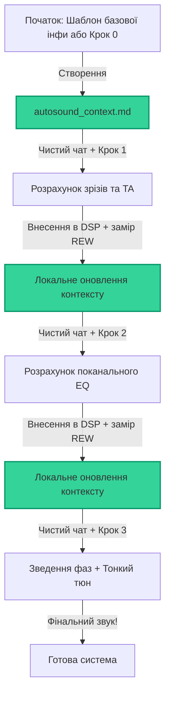

# Ручне покрокове налаштування DSP в будь-якому веб-чаті (Manual Step-by-Step)

> [!WARNING]
> **FIRST DRAFT / ПЕРШИЙ ДРАФТ:**
> This manual step-by-step pipeline is currently a **first draft** and is written in **Ukrainian**. Please note that the standard language of this repository is English. A fully translated English version is planned for future updates.

Ласкаво просимо до **ручного конвеєра налаштування автозвуку**!

Якщо ви не використовуєте автоматичного термінального агента (Claude Code), ви можете отримати таку ж математичну точність і високу якість звуку в будь-якому зручному веб-чаті (**ChatGPT Plus**, **Claude Pro**, **Gemini Advanced / AI Studio**).

Ця папка містить набір детермінованих бездержавних (**stateless**) шаблонів-промптів та шаблонів даних, які перетворюють будь-який веб-чат на професійного акустичного інженера, повністю запобігаючи "дрейфу пам'яті" (memory drift) та спотворенню затримок чи частот.

---

## 📐 Філософія бездержавного веб-чату (Stateless Strategy)

У звичайних тривалих чатах моделі ШІ схильні до накопичення помилок: вони починають плутати фази, забувають частоти зрізів, роблять помилки в розрахунках затримок (ms -> samples) та "вигадують" неіснуючі налаштування. 

**Золоте правило цього конвеєра:**
> ⚠️ **Один Крок = Один новий, абсолютно чистий чат-сеанс.**
> Ви ніколи не ведете одну довгу розмову на кілька годин. Натомість для кожного кроку ви відкриваєте чистий чат, згодовуєте йому ваш файл `autosound_context.md` як статичний контекст, отримуєте розрахунки, вносите їх у DSP, оновлюєте ваш локальний файл контексту та закриваєте чат.

---

## 📂 Структура папки та файли

У цій папці ви знайдете наступні інструменти:

1. **[autosound_context_template.md](autosound_context_template.md)** — **Шаблон для швидкого старту**. Його заповнення повністю автоматизовано за допомогою ШІ. Якщо ви не хочете проходити коротке опитування з ШІ, просто скопіюйте цей файл, вручну заповніть інформацію про ваше авто, динаміки та DSP, збережіть як `autosound_context.md` у вашій робочій папці, і ви готові до Кроку 1!
2. **[step_0_intake_and_setup.md](step_0_intake_and_setup.md)** — Шаблон-інтерв'ю. Замість ручного заповнення ви копіюєте цей промпт у чистий чат, і ШІ проведе з вами інтерактивне опитування для автоматичного створення вашого файлу `autosound_context.md`.
3. **[step_1_baseline_analysis.md](step_1_baseline_analysis.md)** — Шаблон розрахунку точок кросовера, крутизни спадів та точного часового вирівнювання (затримок у мс та семплах під частоту вашого процесора).
4. **[step_2_tonal_balance_eq.md](step_2_tonal_balance_eq.md)** — Шаблон для розрахунку поканального параметричного еквалайзера (PEQ) під цільову криву, аналізу фазової сумації, кутів фазообертання (0-360° all-pass) та мікрокоригування затримок.
5. **[step_3_fine_tuning_and_phase.md](step_3_fine_tuning_and_phase.md)** — Шаблон для фінального полірування та суб'єктивного тюнінгу системи на основі детального відгуку від прослуховування тестових треків (робота зі сценою, різкістю вокалу, бас-бумом тощо).

---

## 🛠️ Покроковий протокол налаштування

### 🏁 Крок 0: Збір базової інфи та створення контексту
* **Дія:** Запустіть промпт [step_0_intake_and_setup.md](step_0_intake_and_setup.md) у веб-чаті або заповніть локальний шаблон [autosound_context_template.md](autosound_context_template.md) вручну.
* **Результат:** Збережений файл `autosound_context.md`. Це ваш єдиний паспорт системи.

---

### ⏱️ Крок 1: Базові кросовери та затримки
* **Вимоги до замірів (Compact Checklist):** 
  * **Одиночні свипи (`sw`)** кожного динаміка (безпечний діапазон, наприклад, 1000–20к Гц для ВЧ, 100–20к Гц для СЧ, 20–20к Гц для мідбасів, 20–200 Гц для саба) з мікрофоном на штативі на рівні вух.
  * **MMM RTA заміри (`rta`)** кожного динаміка окремо навколо голови (для аналізу природного спаду динаміків у їхніх акустичних оформленнях).
  * ⚠️ **ВАЖЛИВО:** Всі кросовери та EQ в DSP мають бути вимкнені (або виставлені тимчасові безпечні захисні HPF, наприклад, 100-300 Гц для СЧ та 1000-2000 Гц для ВЧ).
  * Усі свип-заміри мають бути зроблені **послідовно в одному вікні REW** з увімкненим апаратним таймінгом (петля loopback із налаштованим `TimeOffset` або Acoustic Timing Reference) для збереження відносного часу прильоту звуку.
* **Запуск у чаті:** Відкрийте **НОВИЙ** чат. Надішліть промпт [step_1_baseline_analysis.md](step_1_baseline_analysis.md). Передайте йому ваш `autosound_context.md` та завантажте `.mdat` файл вимірів (або експорт АЧХ/імпульсів). ШІ сам розрахує затримки та зрізи без необхідності ручного переписування з вкладки Info в REW.
* **Внесення в DSP:** Введіть отримані частоти зрізів, типи фільтрів та значення затримок у ваш процесор.
* **Локальне оновлення:** Скопіюйте розраховані значення та вставте їх у відповідний розділ вашого локального файлу `autosound_context.md`, вставивши отриманий результат чату ШІ у відповідний розділ (наприклад, Розділ 4: Поточні налаштування DSP). Закрийте чат.

---

### 🎛️ Крок 2: Тональний баланс, поканальний EQ та оптимізація фаз
* **Вимоги до замірів (Compact Checklist):**
  * **Перевірка DSP:** Всі затримки, гейни та зрізи з Кроку 1 (`v1`) мають бути активні в DSP!
  * **MMM RTA заміри (`rta`)** кожного динаміка окремо (для розрахунку поканального PEQ).
  * **Одиночні свипи (`sw`)** кожного динаміка та **сумарні стики** (`L w+m_2 (sw)`, `R w+m_2 (sw)`, `L m+tw_2 (sw)`, `R m+tw_2 (sw)`, `SW+Ws_2 (sw)`) для аналізу акустичної фазової сумації.
* **Запуск у чаті:** Відкрийте **НОВИЙ** чат. Надішліть промпт [step_2_tonal_balance_eq.md](step_2_tonal_balance_eq.md). Передайте йому оновлений `autosound_context.md` та ваш `.mdat` файл. ШІ сам проаналізує криві.
* **Результат:** ШІ розрахує точні смуги PEQ (частоти, добротність Q, гейни), кути фазообертання (0-360° all-pass) та мікрокоригування затримок.
* **Внесення в DSP:** Імпортуйте або введіть параметри PEQ, фазові налаштування та мікро-затримки у процесор. 
* **Локальне оновлення:** Оновіть таблиці у вашому файлі `autosound_context.md`, скопіювавши розрахунки ШІ у відповідний розділ. Закрийте чат.

---

### 🔄 Крок 3: Суб'єктивний тюн та відгук від прослуховування (Ітеративний цикл)
* **Вимоги до замірів (Compact Checklist):**
  * Переконайтеся, що всі налаштування з Кроку 2 (`v2`) активні в DSP.
  * Зніміть **MMM RTA заміри (`rta`)**: `L_3` (ліва сторона в зборі), `R_3` (права сторона), `ALL_3` (весь фронт).
  * Зніміть **свип-заміри (`sw`)**: `L_3 (sw)`, `R_3 (sw)`, `ALL_3 (sw)`.
* **Оцінка на слух (Де та що слухаємо):**
  * Сядьте на водійське сидіння у звичайну позу. Запустіть якісні тестові треки (AYA, EMMA, Focal).
  * Оцініть: фокус та розмір центрального образу, ширину/висоту/глибину сцени, різкість жіночого вокалу (~80 дБ), гудіння мідбаса чи сабвуфера.
* **Запуск у чаті:** Відкрийте **НОВИЙ** чат. Надішліть промпт [step_3_fine_tuning_and_phase.md](step_3_fine_tuning_and_phase.md). Надайте ШІ ваш `autosound_context.md`, `.mdat` файл замірів та детально опишіть ваш **відгук від прослуховування** за кожним пунктом.
* **Внесення в DSP:** Спробуйте делікатні точкові коригування від ШІ (микро-корекція EQ для вирівнювання вокалу чи усунення різкості, мікрозатримки тощо).
* **Повторюваність:** Цей крок є повторюваним, ітеративним процесом. Ви можете коригувати, знову слухати та давати ШІ новий фідбек до досягнення вашого особистого акустичного ідеалу! Оновіть фінальний пресет у `autosound_context.md`.

---

## 💡 Корисна порада для користувачів Google AI Studio
Якщо ви використовуєте безкоштовне середовище розробника **Google AI Studio** з моделлю **Gemini 1.5 Pro**:
1. У полі **System Instructions** (права панель) ви можете назавжди зафіксувати відповідний промпт кроку (наприклад, з файлу `step_1_baseline_analysis.md`).
2. У полі введення повідомлень ви просто прикріплюєте ваш `autosound_context.md` та дані замірів.
3. Це забезпечить максимально чисту відповідь моделі без будь-яких сторонніх балачок, оскільки інструкція ролі працюватиме на рівні ядра системи!
