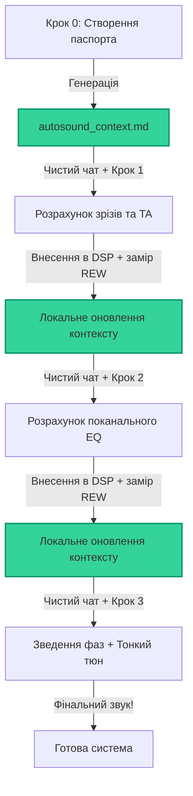

# Ручне покрокове налаштування DSP в будь-якому веб-чаті (Manual Step-by-Step)

> [!WARNING]
> **FIRST DRAFT / ПЕРШИЙ ДРАФТ:**
> This manual step-by-step pipeline is currently a **first draft** and is written in **Ukrainian**. Please note that the standard language of this repository is English. A fully translated English version is planned for future updates.

Ласкаво просимо до **ручного конвеєра налаштування автозвуку**!

Якщо ви не використовуєте автоматичного термінального агента (Claude Code), ви можете отримати таку ж математичну точність і високу якість звуку в будь-кому зручному веб-чаті (**ChatGPT Plus**, **Claude Pro**, **Gemini Advanced / AI Studio**).

Папка `manual_step-by-step` містить набір детермінованих бездержавних (**stateless**) шаблонів-промптів та шаблонів даних, які перетворюють будь-який веб-чат на професійного акустичного інженера.

---

## 📐 Філософія єдиної інструкції та бездержавного веб-чату

Раніше користувачам доводилося копіювати гігантські промпти в системні налаштування кожного разу при переході на новий крок, що викликало багато незручностей у веб-інтерфейсах.

Ми спростили та оптимізували цей процес за допомогою **архітектури єдиної інструкції**:

1. **Єдині системні інструкції:** Ви один раз копіюєте файл **[general_system_instructions.md](general_system_instructions.md)** і вставляєте його у поле **System Instructions** (в Google AI Studio) або **Custom Instructions** (в ChatGPT). Цей файл містить повну роль, всі формули, правила безпеки та логіку для всіх Кроків (0, 1, 2, 3) одночасно.
2. **Бездержавність (Stateless):** Кожен крок налаштування виконується у **новому, чистому вікні чату**, де діють ті самі загальні системні інструкції. Це повністю запобігає "дрейфу пам'яті" (memory drift) та накопиченню помилок у ШІ.
3. **Прості User-промпти:** Для кожного кроку ви просто відкриваєте нову вкладку (де вже прописано загальний системний промпт) і надсилаєте короткий та зручний користувацький промпт, прикріплюючи файл паспорта системи `autosound_context.md` та дані замірів.

---

## 📂 Структура папки та файли

У цій папці ви знайдете наступні інструменти:

1. **[general_system_instructions.md](general_system_instructions.md)** — **Головне ядро системи**. Скопіюйте його та вставте в поле "System Instructions" вашого чату один раз на початку роботи.
2. **[autosound_context_template.md](autosound_context_template.md)** — Шаблон для швидкого ручного старту (якщо ви хочете заповнити дані про динаміки та процесор самостійно без інтерв'ю).
3. **[step_0_intake_and_setup.md](step_0_intake_and_setup.md)** — Промпт-інтерв'ю для автоматичної генерації вашого файлу `autosound_context.md` силами ШІ.
4. **[step_1_baseline_analysis.md](step_1_baseline_analysis.md)** — Промпт для розрахунку базових кросоверів, гейнів та затримок за імпульсними характеристиками.
5. **[step_2_tonal_balance_eq.md](step_2_tonal_balance_eq.md)** — Промпт для розрахунку поканального EQ під цільову криву та точного зведення фаз (Helix Phase кути та мікрозатримки).
6. **[step_3_fine_tuning_and_phase.md](step_3_fine_tuning_and_phase.md)** — Промпт для суб'єктивного тюнінгу системи на основі детального відгуку від прослуховування тестових треків.
7. **[measurement_and_naming_guide.md](measurement_and_naming_guide.md)** — Інструкція із правильного зняття вимірів у REW (поза тіла у кріслі водія для MMM RTA, FFT, RTA Autostop тощо).

---

## 🛠️ Покроковий протокол налаштування

### 🏁 Крок 0: Створення паспорта системи
* **Провідник:** [step_0_intake_and_setup.md](step_0_intake_and_setup.md).
* **Дія:** Скопіюйте промпт Кроку 0 у чистий чат. ШІ проведе інтерактивне інтерв'ю (або застосує *Bypass Gate*, якщо ви дасте всі дані одразу) та видасть готовий паспорт `autosound_context.md`.
* **Результат:** Створіть та збережіть локальний файл `autosound_context.md`.

---

### ⏱️ Крок 1: Базові кросовери та затримки
* **Провідник:** [step_1_baseline_analysis.md](step_1_baseline_analysis.md).
* **Вимоги до замірів:** 
  * Одиночні свипи (`sw`) кожного динаміка на штативі з увімкненим таймінгом (Acoustic Timing Reference або XLR loopback).
  * MMM RTA заміри (`rta`) кожного динаміка окремо навколо голови на рівні вух.
  * Усі кросовери та EQ в DSP мають бути вимкнені (або виставлені тимчасові безпечні HPF).
* **Запуск у чаті:** Відкрийте **НОВИЙ** чат. Надішліть промпт Кроку 1. Передайте йому ваш `autosound_context.md` та завантажте `.mdat` файл вимірів.
* **Внесення в DSP:** Введіть отримані частоти зрізів, типи фільтрів та значення затримок у ваш процесор.
* **Оновлення:** Вставте отримані розрахунки у відповідний розділ вашого локального файлу `autosound_context.md`. Закрийте чат.

---

### 🎛️ Крок 2: Тональний баланс, поканальний EQ та оптимізація фаз
* **Провідник:** [step_2_tonal_balance_eq.md](step_2_tonal_balance_eq.md).
* **Вимоги до замірів:**
  * Усі налаштування з Кроку 1 (`v1`) мають бути активні в DSP!
  * MMM RTA заміри (`rta`) кожного динаміка окремо для розрахунку PEQ.
  * Одиночні свипи (`sw`) кожного динаміка та свипи сумарних стиків (`L w+m_2`, `R w+m_2`, `L m+tw_2`, `R m+tw_2`, `SW+Ws_2`) для аналізу фазової сумації.
* **Запуск у чаті:** Відкрийте **НОВИЙ** чат. Надішліть промпт Кроку 2. Передайте йому оновлений `autosound_context.md` та ваш `.mdat` файл. Вкажіть точні значення фази в градусах, зчитані з REW на частотах кросоверів.
* **Результат:** ШІ розрахує точні смуги PEQ, кути фазообертання Helix Phase та мікрокоригування затримок.
* **Внесення в DSP:** Імпортуйте або введіть параметри PEQ, фазові налаштування та мікро-затримки у процесор. 
* **Оновлення:** Оновіть таблиці у вашому файлі `autosound_context.md`. Закрийте чат.

---

### 🔄 Крок 3: Суб'єктивний тюн та відгук (Ітеративний цикл)
* **Провідник:** [step_3_fine_tuning_and_phase.md](step_3_fine_tuning_and_phase.md).
* **Вимоги до замірів:**
  * Переконайтеся, що всі налаштування з Кроку 2 (`v2`) активні в DSP.
  * Зніміть MMM RTA заміри сумарних сторін: `L_3` (ліва в зборі), `R_3` (права), `ALL_3` (весь фронт).
  * Зніміть свипи сумарних сторін: `L_3 (sw)`, `R_3 (sw)`, `ALL_3 (sw)`.
* **Оцінка на слух:** Сядьте на водійське сидіння у звичайну позу. Запустіть якісні тестові треки. Оцініть: фокус та розмір центрального образу, ширину/висоту/глибину сцени, різкість жіночого вокалу, сибілянти, гудіння басу чи сабвуфера.
* **Запуск у чаті:** Відкрийте **НОВИЙ** чат. Надішліть промпт Кроку 3. Надайте ШІ ваш `autosound_context.md`, `.mdat` файл замірів та детально опишіть ваш відгук від прослуховування.
* **Внесення в DSP:** Спробуйте делікатні точкові коригування від ШІ.
* **Повторюваність:** Цей крок є повторюваним, ітеративним процесом. Ви можете коригувати, знову слухати та давати ШІ новий фідбек до досягнення вашого особистого акустичного ідеалу!

---

## 💡 Порада для користувачів Google AI Studio

Якщо ви використовуєте безкоштовне середовище розробника **Google AI Studio** з моделлю **Gemini 1.5 Pro**:
1. Вставте вміст файлу **[general_system_instructions.md](general_system_instructions.md)** у поле **System Instructions** на правій панелі вікна.
2. Це поле збережеться для всіх нових вкладок чату у цьому ж проекті, тому вам більше не потрібно буде перенастроювати системний промпт.
3. У полі введення повідомлень ви просто надсилаєте короткий користувацький промпт відповідного кроку та прикріплюєте ваш `autosound_context.md` і файл замірів.
4. Це забезпечить максимально чисті, сфокусовані та точні відповіді моделі на будь-якому етапі роботи.
